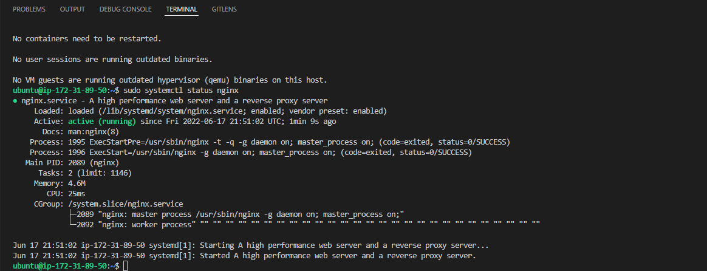
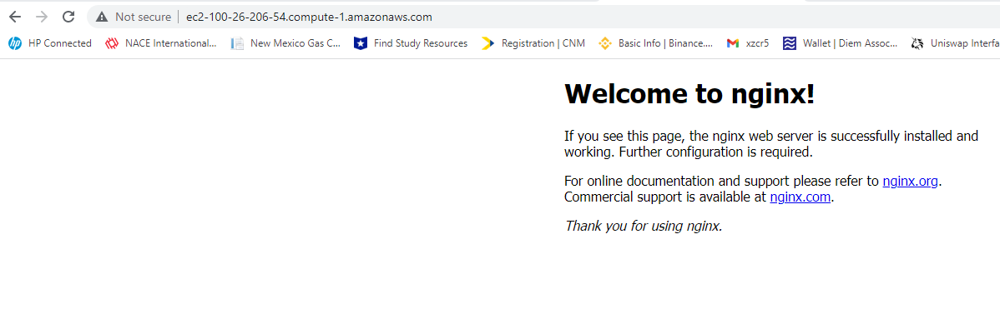
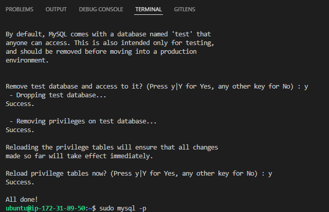
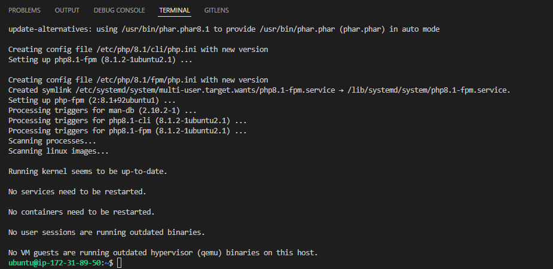
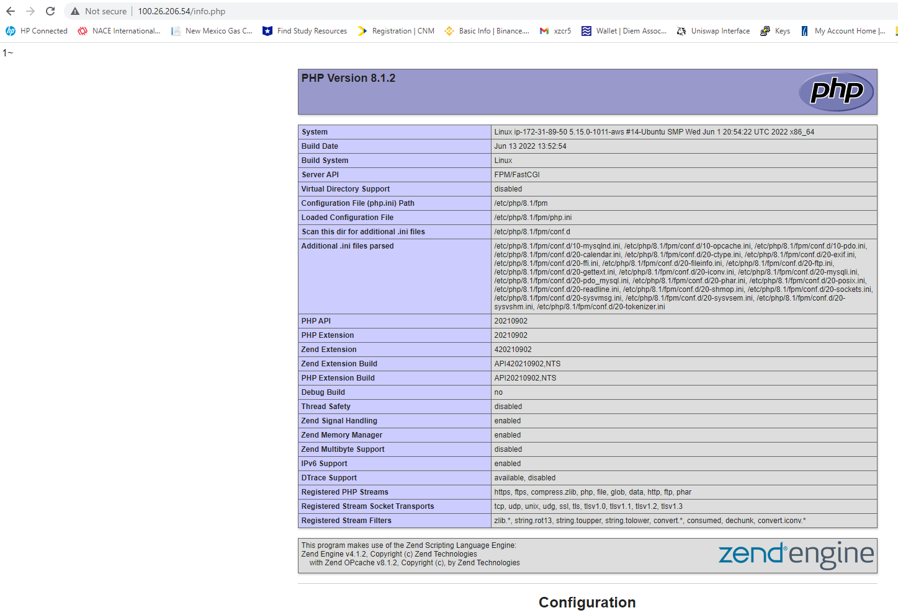

# **Project 2: WEB STACK IMPLEMENTATION *LEMP STACK* IN AWS**

## STEP 1 — *INSTALLING THE NGINX WEB SERVER*

`sudo apt update`

`sudo pat install nginx`

`sudo systemctl status nginx`

`curl http://127.0.0.1:80`

[Nginx Webserver](http://ec2-100-26-206-54.compute-1.amazonaws.com/)

## STEP 2 — *INSTALLING MYSQL*

`sudo apt install mysql-server`

`sudo mysql`

`sudo mysql-secure_installation`

`sudo mysql -p`

## STEP 3 — *INSTALLING PHP*

`sudo apt install php-fpm php`

## STEP 4 — *CONFIGURING NGINX TO USE PHP PROCESSOR*

`sudo mkdir /var/www/projectLEMP`

`sudo chown -R $USER:$USER /var/www/projectLEMP`

`sudo nano /etc/nginx/sites-available/projectLEMP`

`#/etc/nginx/sites-available/projectLEMP

server {
    listen 80;
    server_name projectLEMP www.projectLEMP;
    root /var/www/projectLEMP;

    index index.html index.htm index.php;

    location / {
        try_files $uri $uri/ =404;
    }

    location ~ \.php$ {
        include snippets/fastcgi-php.conf;
        fastcgi_pass unix:/var/run/php/php8.1-fpm.sock;
     }

    location ~ /\.ht {
        deny all;
    }

}`

`sudo ln -s /etc/nginx/sites-available/projectLEMP /etc/nginx/sites-enabled/`

`sudo nginx -t`

`sudo unlink /etc/nginx/sites-enabled/default`

`sudo systemctl reload nginx`

`sudo echo 'Hello LEMP from hostname' $(curl -s http://169.254.169.254/latest/meta-data/public-hostname) 'with public IP' $(curl -s http://169.254.169.254/latest/meta-data/public-ipv4) > /var/www/projectLEMP/index.html`

[LEMP Configured](http://100.26.206.54:80)

## STEP 5 — *TESTING PHP WITH NGINX*

`sudo nano /var/www/projectLEMP/info.`

`<?php
phpinfo();`

[web server](http://100.26.206.54/info.php
)

`sudo rm /var/www/projectLEMP/info.php`

## STEP 6 — *RETRIEVING DATA FROM MYSQL DATABASE WITH PHP (CONTINUED)*

`sudo mysql -p`

`mysql> CREATE DATABASE `example_database`;`

`mysql>  CREATE USER 'example_user'@'%' IDENTIFIED WITH mysql_native_password BY 'password';`

`mysql> GRANT ALL ON example_database.* TO 'example_user'@'%';`

`mysql> exit`

`mysql -u example_user -p`

`mysql> SHOW DATABASES;`

`mysql> CREATE TABLE example_database.todo_list (item_id INT AUTO_INCREMENT,content VARCHAR(255),PRIMARY KEY(item_id));`

`mysql> INSERT INTO example_database.todo_list (content) VALUES ("My first important item");`

`mysql> INSERT INTO example_database.todo_list (content) VALUES ("My second important item");`

`mysql> INSERT INTO example_database.todo_list (content) VALUES ("My third important item");`

`mysql> INSERT INTO example_database.todo_list (content) VALUES ("My fourth important item");`

`mysql>  SELECT * FROM example_database.todo_list;`

 `mysql> exit`

 `nano /var/www/projectLEMP/todo_list.php`

 `<?php
$user = "example_user";
$password = "password";
$database = "example_database";
$table = "todo_list";

try {
  $db = new PDO("mysql:host=localhost;dbname=$database", $user, $password);
  echo "<h2>TODO</h2><ol>";
  foreach($db->query("SELECT content FROM $table") as $row) {
    echo "<li>" . $row['content'] . "</li>";
  }
  echo "</ol>";
} catch (PDOException $e) {
    print "Error!: " . $e->getMessage() . " ";
    die();
}`

`Ctrl+X`

`y`

`Enter`

[web page](http://100.26.206.54/todo_list.php)
