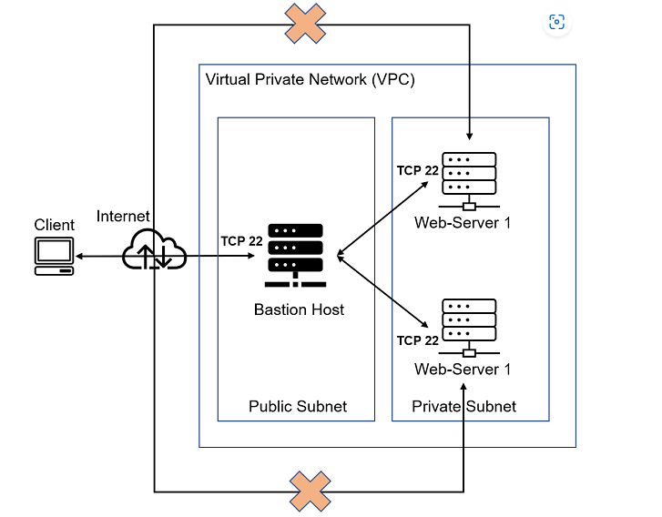
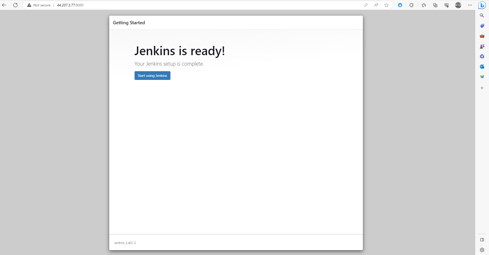
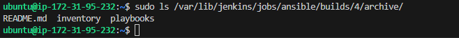

# Project 11: ANSIBLE CONFIGURATION MANAGEMENT - AUTOMATE PROJECT 7 TO 10

### Task

1. Install and configure Ansible client to act as a Jump Server/Bastion Host

2. Create a simple Ansible playbook to automate servers configuration

## A typical VIRTUAL PRIVATE NETWORK /VPC INFRASTRUCTURE
An illustration diagram of a Bastion Host serving as a VPN.



## Tip: Every time you stop/start your Jenkins-Ansible server – you have to reconfigure GitHub webhook to a new IP address, in order to avoid it, it makes sense to allocate an Elastic IP to your Jenkins-Ansible server. Note that Elastic IP is free only when it is being allocated to an EC2 Instance, so do not forget to release Elastic IP once you terminate your EC2 Instance. Remember to save or Auto save any project edited or worked on vscode. Also git status and push when edited and run build on jenkins server.


## STEP 1 — *INSTALL AND CONFIGURE ANSIBLE ON EC2 INSTANCE*

#### 1. Update "Name" tag on your Jenkins Ubuntu 20.04 EC2 Instance port 8080 to Jenkins-Ansible. We will use this server to run playbooks. 


#### 2. In your GitHub account create a new repository and name it ansible-config-mgt, allow pub and create.

#### 3. Install Ansible

`ssh -i "PBDEV.pem" ubuntu@ec2-3.93.6.197.compute-1.amazonaws.com`

`sudo apt update`

`sudo apt install ansible -y`

`ansible --version`

#### 4. Configure Jenkins build job to save your repository content every time you change it – this will solidify your Jenkins configuration skills acquired in Project 9.

#### Login to Jenkins browser 

`http://3.93.6.197/:8080/`

#### *Enter project 9 Jenkins username and password. But if you terminated your Project 9 instance as is the case here do this below*

*Retrieve/copy Jenkins Password from your server to login: /var/lib/jenkins/secrets/initialAdminPassword* 

`sudo cat /var/lib/jenkins/secrets/initialAdminPassword`

*copy password into jenkins browser, then Install suggested plugins from server, create admin username and password and get your Jenkins server address (http://3.93.6.197/)*



## - Create a new Freestyle project ansible in Jenkins and point it to your ‘ansible-config-mgt’ repository.

*In configuration of your Jenkins freestyle project choose - New Item - Enter Item Name (ansible) - select Freestyle project - Ok.*

## - Configure Webhook in GitHub and set webhook to trigger ansible build.

*Go to settings - webhook - Add webhook - paste JenkinsURL/github-webhook (http://3.93.6.197:8080/github-webhook/) - content type/application/jason - push event - Active - Add webhook* 

## - Configure a Post-build job to save all (**) files, like you did it in Project 9.

*Go to Jenkins Dashboard, project (ansible) - General - Discard old builds - Max # of builds to keep (3) - Source Code Management - Git - RepositoryURL (*https://github.com/Bethrand/ansible-config-mgt.git*) - Credentials Add - UsrnamePassword(of github account but if it fails you might be prompted to use github personal Assess Token) - Add - Select Username on Credential - Apply - Save*

*Save the configuration and let us try to run the build. For now we can only do it manually. Click “Build Now” button, if you have configured everything correctly, the build will be successfull and you will see it under #1 - console output (view details)*

*JENKINS BUILD STATUS: You can open the build and check in “Console Output” if it has run successfully*

*JENKINS CONSOLE OUTPUT*


#### 5. Test your setup by making some change in README.MD file in main branch (it is suppose to be master branch but we created in main) and make sure that builds starts automatically and Jenkins saves the files (build artifacts) in following folder

##### - ls /var/lib/jenkins/jobs/ansible/builds/<build_number>/archive/

`sudo ls /var/lib/jenkins/jobs/ansible/builds`

1  2  3  legacyIds  permalinks

`sudo ls /var/lib/jenkins/jobs/ansible/builds/3/archive/`

README.md

`cd /var/lib/jenkins/jobs/ansible/builds/3/archive/`

`cat README.md`

# ansible-config-mgt

`exit`

# Now our setup will look like this: 


#### Note: Everytime you stop/start your Jenkins-Ansible server, you must reconfigure your Github webhook to the new IP address if you dont allocate an Elastic IP address to the server.

## STEP 2 — *Prepare your development environment using Visual Studio Code*

#### 1. Clone down your ansible-config-mgt repo to your Jenkins-Ansible instance through your VSCode extensions and save folder within your workspace. But better to open a VSCode in a seperate window to do this. From bottom of VSCode window, raise the tab to access Terminal into your ansible-config-mgt folder.

To git clone https://github.com/Bethrand/ansible-config-mgt.git , use new Vscode window - open Remote Repository - open repo from Github - Bethrand\ansible-config-mgt - save in project folder - open (it's best to open in a separate vscode window and work there)

### Step 3 - *BEGIN ANSIBLE DEVELOPMENT*

#### 1. In your ansible-config-mgt GitHub repository, create a new branch that will be used for development of a new feature. Tip: Give your branches descriptive and comprehensive names, for example, if you use Jira or Trello as a project management tool – include ticket number (e.g. PRJ-145) in the name of your branch and add a topic and a brief description what this branch is about – a bugfix, hotfix, feature, release (e.g. feature/prj-145-lvm)

let's confirm our branch;

`git status`

`git branch`

`git status`

`git checkout -b prj-11`  - ticket number (prj-11)

#### 2. Checkout the newly created feature branch to your local machine and start building your code and directory structure

#### 3. Create a directory and name it `playbooks` – it will be used to store all your playbook files. Use GIT BASH, PowerShell doesn't understand UNIX cmd on git environment

`mkdir playbooks`

#### 4. Create a directory and name it `inventory` – it will be used to keep your hosts organised.

`mkdir inventory`

#### 5. Within the playbooks folder, create your first playbook file, and name it `common.yml`

`cd playbooks`

`touch common.yml`


##### 6. Within the inventory folder, create an inventory file (.yml) for each environment (Development, Staging Testing and Production) dev, staging, uat, and prod respectively.

`cd ..`

`cd inventory`

`touch dev.yml staging.yml uat.yml prod.yml`

## Step 4 – *Set up an Ansible Inventory*

An Ansible inventory file defines the hosts and groups of hosts upon which commands, modules, and tasks in a playbook operate. Since our intention is to execute Linux commands on remote hosts, and ensure that it is the intended configuration on a particular server that occurs. It is important to have a way to organize our hosts in such an Inventory.

Save below inventory structure in the inventory/dev file to start configuring your development servers. Ensure to replace the IP addresses according to your own setup.

Note: Ansible uses TCP port 22 by default, which means it needs to ssh into target servers from Jenkins-Ansible host – for this you can implement the concept of ssh-agent. 

#### 1. Now you need to import your key into ssh-agent:

`eval `ssh-agent -s``     *- in Jenkins-Ansible server*

Agent pid 2338

`ssh-add -k Downloads\PBDEV.pem`          *- path-to-private-key*

`ssh-add -l`

`ssh -A ubuntu@3.93.6.197`

`ssh-add -l`  - *run to persist the key on the server*

2048 SHA256:rUynJn4w9ZE0s+x9qpFG4oTg9NpLjMf2QV3hJSFow5c downloads\PBDEV.pem (RSA)

>OR    

#### If you need to add a new .pem key, you can run the below code. We ignored this as we added key earlier on previous projects:

#### - Open another vscode as an administrator, raise the tab from bottom of the window to access terminal.

> Start code from:

[`cd ugosu` - the path .ssh file was installed

`Get-WindowsCapability -Online | Where-Object Name -like 'OpenSSH*'` - to check if openssh is installed completely

`# Start the sshd service`

`Start-Service sshd`

`# OPTIONAL but recommended:`

`Set-Service -StartupType Automatic`

`# Confirm the Firewall rule is configured. It should be created automatically by setup. Run the following to verify`

if (!(Get-NetFirewallRule -Name "OpenSSH-Server-In-TCP" -ErrorAction SilentlyContinue | Select-Object Name, Enabled)) {
>>     Write-Output "Firewall Rule 'OpenSSH-Server-In-TCP' does not exist, creating it..."
>>     New-NetFirewallRule -Name 'OpenSSH-Server-In-TCP' -DisplayName 'OpenSSH Server (sshd)' -Enabled True -Direction Inbound -Protocol TCP -Action Allow -LocalPort 22
>> } else {
>>     Write-Output "Firewall rule 'OpenSSH-Server-In-TCP' has been created and exists."
 

` ssh-keygen -t ed25519`

`Enter`

`Enter`

`Enter`

` Get-Service ssh-agent | Set-Service -StartupType Automatic`

` Start-Service ssh-agent`

` Get-Service ssh-agent`

`cd downloads`

`ls *.pem`

` ssh-add PBDEV.pem`

` ssh-add -l`

#### - Now, ssh into your Jenkins-Ansible server using ssh-agent. (ssh -A ubuntu@public-ip) Be mindful you must cd into path housing your downloads(.pem) Not to cd downloads. (Open another vscode to go back to your working vscode NOT as an administrator, in extensions tab install remote ssh (if you have not already), go to >< open a remote window and select SSH config file to update – select the first (/users/ugosu/.ssh/config) – edit the config to the instance you want to connect – go to >< open a remote window - select connect to host – select instance name – continue - it is best to even install remote development that has remote ssh in it to do all these. If you connect to Jenkins-Ansible instance with this, you can also connect other servers instance using their private IP address within the Jenkins-Ansible server.)

`cd ugosu`

`ssh-agent`

`ssh-add -k downloads\PBDEV.pem`

`ssh-add -l`

`ssh -A ubuntu@43.93.6.197`

`ssh-add -l`

2048 SHA256:rUynJn4w9ZE0s+x9qpFG4oTg9NpLjMf2QV3hJSFow5c downloads\PBDEV.pem (RSA)

> End code here. Then, continue with below code:
#### 2. Now, Let's test if we can log into other servers Private IP addresses within the VPC Jenkins-Ansible ssh agent:

`ssh ubuntu@172.31.83.144`  -Nginxlb Private IPv4 addresses

`exit`

`ssh ec2-user@172.31.88.2` -NFS Server Private IPv4 addresses

`exit`

#### 4. So, back to the VSCode we have our ANSIBLE-CONFIG-MGT. Update your inventory/dev.yml file with this snippet of code as you write in .md:
[nfs]
<NFS-Server-Private-IP-Address> ansible_ssh_user='ec2-user'
[webservers]
<Web-Server1-Private-IP-Address> ansible_ssh_user='ec2-user'
<Web-Server2-Private-IP-Address> ansible_ssh_user='ec2-user'
[db]
<Database-Private-IP-Address> ansible_ssh_user='ubuntu' 
[lb]
<Load-Balancer-Private-IP-Address> ansible_ssh_user='ubuntu'

```
[nfs]
172.31.88.2 ansible_ssh_user='ec2-user'

[webservers]
172.31.83.67 ansible_ssh_user='ec2-user'
172.31.92.197 ansible_ssh_user='ec2-user'

[db]
172.31.92.240 ansible_ssh_user='ubuntu' 

[lb]
172.31.83.144 ansible_ssh_user='ubuntu'
```
## Step 5 - *Create a Common Playbook* 
Instruct Ansible what you need performed on all servers listed in 'inventory/dev' as you write in .md.
In 'common.yml' playbook, you will write configuration for repeatable, re-usable, and multi-machine tasks that is common to systems within the infrastructure.
Yml starts with '---'. 

#### 1. Update your `playbooks/common.yml` file with following code:

```- name: update web, and nfs servers
  hosts: webservers, nfs
  remote_user: ec2-user
  become: yes
  become_user: root
  tasks:
    - name: ensure wireshark is at the latest version
      yum:
        name: wireshark
        state: latest

- name: update db and LB server
  hosts: db, lb
  remote_user: ubuntu
  become: yes
  become_user: root
  tasks:
    - name: Update apt repo
      apt: 
        update_cache: yes

    - name: ensure wireshark is at the latest version
      apt:
        name: wireshark
        state: latest
```

##### *Examine the code above and try to make sense out of it. This playbook is divided into two parts (2 servers), each of them is intended to perform the same task: install wireshark utility (or make sure it is updated to the latest version) on your RHEL 8 and Ubuntu servers. It uses root user to perform this task and respective package manager: yum for RHEL 8 and apt for Ubuntu.*

## Step 6 – *Update GIT with the latest code*
Now all of your directories and files live on your machine and you need to push changes made locally to GitHub.
Now you have a separate branch, a Pull Request (PR) is employed to get your branch peer reviewed and merged to the [main] branch.

#### 1. Commit your code into GitHub:

`git status`

`git add ../playbooks/`    - git add <filename>

`git commit -m "added playbooks folder"`

`git push origin prj-11`

#### 2. Create a Pull request (PR)
Create a pull request for 'prj-11' on GitHub by visiting:

`https://github.com/Bethrand/ansible-config-mgt/pull/new/prj-11`

On github - projectname - compare&pull - create pull request - Merge pull request (if no conflict) - Confirm Merge - code (check code to confirm files created). 

#### 3. Head back into your ansible-config-mgt vscode terminal, checkout from the feature branch into the main, and pull down the latest changes.

`git status`

`git checkout main`  - switched to branch main

`git status` - branch up to date

`git pull`   -  getting what we have in our project branch into our main branch.

You can first visit your jenkins server to view latest build and changes made. Once your code changes appear in main branch – Jenkins will do its job and save all the files (build artifacts) to /var/lib/jenkins/jobs/ansible/builds/<build_number>/archive/ directory on Jenkins-Ansible server.

#### 5. On Jenkins-Ansible terminal: 

`sudo ls /var/lib/jenkins/jobs/ansible/builds/4/archive/`

`cd /var/lib/jenkins/jobs/ansible/builds/4/archive/`

`cd inventory`

`cat dev.yml`



## Step 7 – *Run first Ansible test*
Now, it is time to execute ansible-playbook command and verify if your playbook actually works: 

#### 1. On the ansible-config-mgt separate VSCode: Go to Extensions - type Remote Dev - >< open a remote window - connect to host or select configured file update- C:/Users/ugosu/Downloads/PBDEV.pem - >< open a remote window - select Linux 
[Edit host as follows] `Host - Jenkins-Ansible (server name), HostName - 3.93.6.197 (pub IP), User - ubuntu, IdentityFile - C:/Users/ugosu/Downloads/PBDEV.pem (.pem key path)` - >< open a remote window - select Linux - [for ubuntu Terminal]

Then, open a folder from home directory on the terminal /home/ubuntu - okay
<build_number is 5>

`ansible-playbook -i /var/lib/jenkins/jobs/ansible/builds/<build_number>/archive/inventory/dev.yml /var/lib/jenkins/jobs/ansible/builds/<build_number>/archive/playbooks/common.yml` - *links to inventory/dev.yml & playbooks/common.yml files that worked on*

`yes`

#### 2. you can go to each of the servers and check if wireshark has been installed by running `which wireshark` or `wireshark --version`

Connect via SSH-agent back into your Jenkins-Ansible VPC and run checks

`ssh ubuntu@172.31.83.144` -lb

`which wireshark`

/usr/bin/wireshark

`wireshark --version`


 
`exit`

`ssh ubuntu@172.31.92.240` - db

`wireshark --version`

`which wireshark`

/usr/bin/wireshark

`exit`

`ssh ec2-user@172.31.88.2` nfs

`which wireshark`

/usr/bin/wireshark

`exit`

`ssh ec2-user@172.31.83.67`


`exit`

`ssh ec2-user@172.31.92.197`

`which wireshark`

/usr/bin/wireshark

`exit`

## ANSIBLE INFRASTRUCTURE DIAGRAM
Our updated Ansible Architecture will now look like the diagram below:


## Optional Step – Repeat once again

Update your ansible playbook with some new Ansible tasks and go through the full 
checkout -> change codes -> commit -> PR -> merge -> build -> ansible-playbook cycle again to see how easily you can manage a servers fleet of any size with just one command!

`ansible-config-mgt/` - open a separate vscode to call up the git repo for ansible-config-mgt

`git checkout prj-11` to go change branch to prj-11

`git pull`

In playbooks/common.yml paste:

```
- name: create directory, file and set timezone on all servers
  hosts: webservers, nfs, db, lb
  become: yes
  tasks:

    - name: create a directory
      file:
        path: /home/sample
        state: directory

    - name: create a file
      file:
        path: /home/sample/ansible.txt
        state: touch

    - name: set timezone
      become: yes
      ansible.builtin.timezone:
        name: America/Los_Angeles 
```         

commit vscode - source control - type commit message - check commit - check yes - ... select push on 3 doted line - check yes.

on github - select current project folder - compare&pull request - create pull request - merge pull request - confirm merge - go to Jenkins server - build Jenkins - go to Vscode current working platform and run below:

`git checkout main`

`git pull` 

Using SSH-Agent into Jenkins-Ansible

`ansible-playbook -i /var/lib/jenkins/jobs/ansible/builds/9/archive/inventory/dev.yml /var/lib/jenkins/jobs/ansible/builds/9/archive/playbooks/common.yml`


#### run `which wireshark` or `wireshark --version`

`ssh ubuntu@172.31.83.144` -lb

`which wireshark`

`/usr/bin/wireshark`

`date`

Thu Jul 27 08:16:18 PDT 2023

`exit`

`ssh ec2-user@172.31.88.2` nfs

`which --version`

```
ubuntu@ip-172-31-95-232:~$ ssh ec2-user@172.31.88.2
Register this system with Red Hat Insights: insights-client --register
Create an account or view all your systems at https://red.ht/insights-dashboard
Last login: Thu Jul 27 08:08:49 2023 from 172.31.95.232
[ec2-user@ip-172-31-88-2 ~]$ wireshark --version
Wireshark 2.6.2 (v2.6.2)
```

`exit`