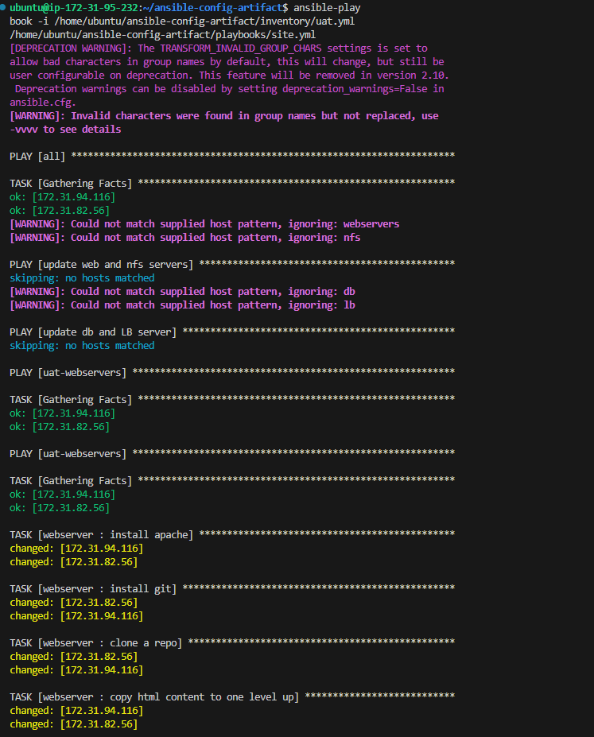
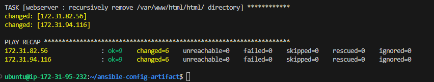

# Project 12: ANSIBLE REFACTORING AND STATIC ASSIGNMENTS (IMPORTS AND ROLES)

### Task

In this project you will continue working with ansible-config-mgt repository and make some improvements of your code. Now you need to refactor your Ansible code, create assignments, and learn how to use the imports functionality. Imports allow to effectively re-use previously created playbooks in a new playbook – it allows you to organize your tasks and reuse them when needed.

## Step 1. – Jenkins job enhancement
Before we begin, let us make some changes to our Jenkins job – now every new change in the codes creates a separate directory which is not very convenient when we want to run some commands from one place. Besides, it consumes space on Jenkins serves with each subsequent change. Let us enhance it by introducing a new Jenkins project/job – we will require Copy **Artifact plugin**.

#### 1. Go to your Jenkins-Ansible server and create a new directory called ansible-config-artifact – we will store there all artifacts after each build.

open a separate VSCode and use remote ssh Agent to log into Jenkins-Ansible server: >< select open a remote window - connect to host - select Jenkins-Ansible (previously configured Host). > >Ensure you update hostname settings with current Jenkins Host pub ip on Vscode, Update webhook on github and Update Jenkins Configuration URL on Jenkins browser)

`sudo mkdir /home/ubuntu/ansible-config-artifact`

let's open our newly created ansible-config-artifact on the explorer. Go to explorer - open folder - /home/ubuntu/ansible-config-artifact.

#### 2. Change permissions to this directory, so Jenkins could save files there 

`sudo chmod -R 0777 /home/ubuntu/ansible-config-artifact`

#### 3. Go to Jenkins web console -> Manage Jenkins -> Manage Plugins or Plugins -> on **Available plugins** tab search for **Copy Artifact** and install this plugin without restarting Jenkins.

#### 4. Create a new Freestyle project (you have done it in Project 9) and name it **save_artifacts**. 

On Jenkins Server - DASHBOARD -> NEW ITEM -> type in 'save_artifacts' -> select Freestyle project -> ok


#### 5. This project will be triggered by completion of your existing ansible project. Configure it accordingly:

On Jenkins Server - General -> check 'Discard old builds' -> Max # of builds to keep '2' - Build Triggers -> under Build after other projects are built, Projects to watch type in 'ansible,' ->  save


> Note: You can configure number of builds to keep in order to save space on the server, for example, you might want to keep only last 2 or 5 build results. You can also make this change to your ansible job.

#### 6. The main idea of save_artifacts project is to save artifacts into /home/ubuntu/ansible-config-artifact directory. To achieve this:

Create a Build step -> choose Copy artifacts from other project -> specify 'ansible' as a source project -> Artifacts to copy '**' -> specify  '/home/ubuntu/ansible-config-artifact' in target directory -> save


#### 7. Test your set up by making some change in README.MD file inside your ansible-config-mgt repository (project 11) (right inside main branch).

If both Jenkins jobs have completed one after another – you shall see your files inside /home/ubuntu/ansible-config-artifact directory and it will be updated with every commit to your main branch.

Now your Jenkins pipeline is more neat and clean.

TEST OUTPUT:


## Step 2. – Refactor Ansible code by importing other playbooks into `site.yml`

Refactoring as a technique for iterative improvements will be deployed here. Before starting to refactor the codes, ensure that you have pulled down the latest code from your `main (master)` branch, and created a new branch, name it `refactor`.

In `Project 11` we wrote all tasks in a single playbook `common.yml`,  Breaking tasks up into different files is an excellent way to organize complex sets of tasks and reuse them. 
Let see code re-use in action by importing other playbooks:

#### 1. - You can use Mkdir and touch to create within the `ansible-config-mgt` directory/ terminal. Spin up a separate VScode for `ansible-config-mgt` from project 11. we will create these manually by adding files and folders on `ansible-config-mgt` VSCode Explorer:

 So within `playbooks folder`, create a new file and name it `site.yml` – This file will now be considered as an entry point into the entire infrastructure configuration. Other playbooks will be included here as a reference. In other words, `site.yml` will become a parent to all other playbooks that will be developed. Including `common.yml` created previously.

#### 2. - Create a new folder in root of the repository and name it `static-assignments`. The `static-assignments folder` is where all other children playbooks will be stored. This is merely for easy organization of your work. It is not an Ansible specific concept, therefore you can choose how you want to organize your work. You will see why the folder name has a prefix of static very soon. 

 Manually click ansible-config-mgt on you VScode explorer -> to create `static-assignments` folder

#### 3. - Move `common.yml` file into the newly created `static-assignments` folder.

 Manually move `common.yml` into `static-assignments` folder

#### 4. - Inside `site.yml` file, import `common.yml` playbook write codes below inside it:

```
- hosts: all
- import_playbook: ../static-assignments/common.yml
```

The code above uses built in import_playbook Ansible module.

### Folder Structure should look like this;


#### 5. - Run ansible-playbook command against the dev environment.
Since you need to apply some tasks to your dev servers and wireshark is already installed – you can go ahead and create another playbook under `static-assignments` and name it `common-del.yml`. In this playbook, configure deletion of wireshark utility.

```
- name: update web and nfs servers
  hosts: webservers, nfs
  remote_user: ec2-user
  become: yes
  become_user: root
  tasks:
  - name: delete wireshark
    yum:
      name: wireshark
      state: removed

- name: update db and LB server
  hosts: db, lb
  remote_user: ubuntu
  become: yes
  become_user: root
  tasks:
  - name: delete wireshark
    apt:
      name: wireshark-qt
      state: absent
      autoremove: yes
      purge: yes
      autoclean: yes
```

update `site.yml` with `- import_playbook: ../static-assignments/common-del.yml` instead of `common.yml` and run it against dev servers:

`git pull`

`git status`
 
use source control to do `git add` to current working folder -> type message like updates -> check to commit 

`git commit -m "updates"`

`push`

Then see if changes effected on ansible-config-artifacts via our Vscode ssh agent platform and ping to see if they are reachable:

`pwd`

`cd /home/ubuntu/ansible-config-artifact/inventory` - directory to our dev.yml environment

`pwd`

`sudo vi /etc/ansible/ansible.cfg` - to point where inventory are by editing and removing comment # from `inventory = /etc/ansible/hosts` to `inventory = /home/ubuntu/ansible-config-artifact/inventory`

`ansible all -m ping`  - m flag is stating module to use as ping

ALL HOSTS AVAILABLE:


Let's Run our playbook:

`cd ..`

`ansible-playbook -i /home/ubuntu/ansible-config-artifact/inventory/dev.yml /home/ubuntu/ansible-config-artifact/playbooks/site.yml`

Wireshark Deleted Successfully on all Servers:


Let's check again to confirm by runing the below codes on the servers:

`cd..`

`ssh ec2-user@172.31.88.2`   - nfs

`which wireshark` and `wireshark --version` 


`exit`

`ssh ubuntu@172.31.83.144`  - lb

`which wireshark` and `wireshark --version` 


`exit`

### So we have completed the use of `import_playbooks module` and we have a ready solution to `install/delete packages` on multiple servers with just one command.

## Step 3. – Configure UAT Webservers with a role ‘Webserver’

We will create a new branch `refactor` where we will be working on.

`git status`

`git checkout -b refactor` - to switch to a new branch refactor.

We have our nice and clean dev environment, so let us put it aside and configure 2 new Web Servers as uat. We could write tasks to configure Web Servers in the same playbook, but it would be too messy, instead, we will use a dedicated role to make our configuration reusable.

#### 1. Launch 2 fresh EC2 instances using RHEL 8 image, we will use them as our `uat` servers, so give them names accordingly – `Web1-UAT` and `Web2-UAT`.
Tip: Do not forget to stop EC2 instances that you are not using at the moment to avoid paying extra. For now, you only need 2 new RHEL 8 servers as Web Servers and 1 existing `Jenkins-Ansible` server up and running.


#### 2. To create a role, you must create a directory called `roles/`, relative to the playbook file or in `/etc/ansible/` directory.
There are two ways to create this folder structure:
- You may choose to use an Ansible utility called ansible-galaxy inside ansible-config-mgt/roles directory (you need to create roles directory upfront)

```
mkdir roles
cd roles
ansible-galaxy init webserver
```

#### 'OR' this option we will adopt:

This is the option we will use:
- Create the directory/files structure manually:

> Note: You can choose either way, but since you store all your codes in GitHub, it is recommended to create folders and files there rather than locally on Jenkins-Ansible server.

The entire folder structure should look like below, but if you create it manually – you can skip creating `tests, files, and vars` or remove them if you used `ansible-galaxy`

After removing unnecessary directories and files, the `roles` structure should look like this:


```
└── webserver
    ├── README.md
    ├── defaults
    │   └── main.yml
    ├── handlers
    │   └── main.yml
    ├── meta
    │   └── main.yml
    ├── tasks
    │   └── main.yml
    └── templates
```
#### 3. Update your inventory ansible-config-mgt/inventory/uat.yml file with private IP addresses of your 2 UAT Web servers

```
[uat-webservers]
172.31.82.56 ansible_ssh_user='ec2-user' ansible_ssh_private_key_file='C:/Users/ugosu/Downloads/PBDEV.pem'
172.31.94.116 ansible_ssh_user='ec2-user' ansible_ssh_private_key_file='C:/Users/ugosu/Downloads/PBDEV.pem'

```

NOTE: Ensure you are using ssh-agent to ssh into the Jenkins-Ansible instance just as you have done in project 11;

#### 4. SSH agent into Jenkins-Ansible; In `/etc/ansible/ansible.cfg` file uncomment roles_path string and provide a full path to your roles directory `roles_path    = /home/ubuntu/ansible-config-artifact/roles`, so Ansible could know where to find configured roles.

`sudo vi /etc/ansible/ansible.cfg`

`pwd`

`roles_path  =  /home/ubuntu/ansible-config-artifact/roles`

#### 5. Within the `refactor` branch; It is time to start adding some logic to the webserver role. Go into `tasks` directory, and within the `main.yml` file, start writing configuration tasks to do the following:

- Install and configure Apache (httpd service)
- Clone Tooling website from GitHub https://github.com/<your-name>/tooling.git.
- Ensure the tooling website code is deployed to /var/www/html on each of 2 UAT Web servers.
- Make sure httpd service is started

So write on `main.yml` the following `tasks`:

```
---
- name: install apache
  become: true
  ansible.builtin.yum:
    name: "httpd"
    state: present

- name: install git
  become: true
  ansible.builtin.yum:
    name: "git"
    state: present

- name: clone a repo
  become: true
  ansible.builtin.git:
    repo: https://github.com/Bethrand/tooling.git
    dest: /var/www/html
    force: yes

- name: copy html content to one level up
  become: true
  command: cp -r /var/www/html/html/ /var/www/

- name: Start service httpd, if not started
  become: true
  ansible.builtin.service:
    name: httpd
    state: started

- name: recursively remove /var/www/html/html/ directory
  become: true
  ansible.builtin.file:
    path: /var/www/html/html
    state: absent
```
## Step 4. – Reference ‘Webserver’ role
Within the `static-assignments` folder, create a new assignment for **uat-webservers** `uat-webservers.yml` file. This is where you will reference the role:
```
---
- hosts: uat-webservers
  roles:
     - webserver
```

Remember that the entry point to our ansible configuration is the `site.yml` file. Therefore, you need to refer your `uat-webservers.yml` role inside `site.yml`.

So, we should have this in site.yml

```
---
- hosts: all
- import_playbook: ../static-assignments/common.yml

- hosts: uat-webservers
- import_playbook: ../static-assignments/uat-webservers.yml
```

`save`

## Step 5. – Commit & Test
Commit your changes, create a Pull Request and merge them to `main` branch, make sure webhook triggered two consequent Jenkins jobs, they ran successfully and copied all the files to your `Jenkins-Ansible` server into `/home/ubuntu/ansible-config-artifact/` directory.

`git checkout main` - on the refactor branch Vscode

Look at the ansible-config-artifact ssh sever and see that the `roles` have all been added.

Now, run the playbook against your `uat.yml` inventory and see what happens:

`ansible all -m ping`

```
ansible-playbook -i /home/ubuntu/ansible-config-artifact/inventory/uat.yml /home/ubuntu/ansible-config-artifact/playbooks/site.yml
```

PLAYBOOK AGAINST UAT.YML



You should be able to see both of your UAT Web servers configured and you can try to reach them from your browser:

http://Web1-UAT-Server-Public-IP-or-Public-DNS-Name>/index.php

http://3.88.226.100/index.php

or

http://<Web1-UAT-Server-Public-IP-or-Public-DNS-Name/index.php

http://18.206.54.183/index.php


Your Ansible architecture should now be looking like this except **DB server** moving over to Ubuntu dev servers:

