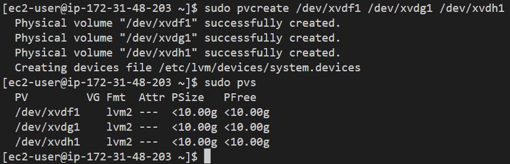

# **Project 6: WEB SOLUTION WITH WORDPRESS - Prepare storage infrastructure on two Linux servers and implement a basic web solution using WordPress**

## STEP 1 — *Prepare a Web Server*

#### 1 *Launching an EC2 instance that will serve as "Web Server". Create 3 volumes in the same AZ as your Web Server EC2, each of 10 GiB*

#### 2 *Connecting web-server to instance*

`ssh -i "project-6.pem" ec2-user@ec2-100-25-163-152.compute-1.amazonaws.com`

#### 3  - *Using lsblk command to inspect what block devices are attached to server.Notice names of your newly created devices. All devices in Linux reside in /dev/ directory. Inspect it with ls /dev/ and make sure you see all 3 newly created block devices there – their names will likely be xvdf, xvdh, xvdg*

`lsblk`

#### 4 - *Using df -h command to see all mounts and free space on your server*

`df -h` 

#### 5 - *Using gdisk utility to create a single partition on each of the 3 (xvdf xvdg xvdh) disks*

`sudo gdisk /dev/xvdf` 

`?` - *shows help listing of all command*

`n` - *enter n to add a new partition*

`1` - *to select default*

`enter` - *first sector*

`enter` - *displays Last sector*

`8E00`

`p` - *to preview*

`w` - *to write*

`y` - *to complete partition*

`sudo gdisk /dev/xvdg` - *Use gdisk utility to create a single partition on each of the 3 (xvdf xvdg xvdh) disks*

`n` - *enter n to add a new partition*

`1` - *to select default*

`enter` - *first sector*

`enter` - *displays Last sector*

`8300`

`p` - *to preview*

`w` - *to write*

`y` - *to complete partition*

`sudo gdisk /dev/xvdh` - *Use gdisk utility to create a single partition on each of the 3 (xvdf xvdg xvdh) disks*

`n` - *enter n to add a new partition*

`1` - *to select default*

`enter` - *first sector*

`enter` - *displays Last sector*

`8300`

`p` - *to preview*

`w` - *to write*

`y` - *to complete partition*

#### 6 - *Using lsblk utility to view the newly configured partition on each of the 3 disks*

`lsblk` 

#### 7 - *Installing lvm2 package using sudo yum install lvm2. Run sudo lvmdiskscan command to check for available partitions. Note: RedHat uses yum to install whereas ubuntu uses apt*

`sudo yum install lvm2 -y`

`sudo lvmdiskscan` 

#### 8 - *Using pvcreate utility to mark each of 3 disks as physical volumes (PVs) to be used by LVM*

`sudo pvcreate /dev/xvdf1 /dev/xvdg1 /dev/xvdh1` 

#### 9 - *Verifying that your Physical volume has been created successfully by running sudo pvs*

`sudo pvs` 

#### 10 - *Using vgcreate utility to add all 3 PVs to a volume group (VG). Name the VG webdata-vg*

`sudo vgcreate webdata-vg /dev/xvdh1 /dev/xvdg1 /dev/xvdf1` 

#### 11 - *Verifying that your VG has been created successfully by running sudo vgs*

`sudo vgs`

#### 12 - *Using lvcreate utility to create 2 logical volumes. apps-lv (Use half of the PV size - 29.99g/2 = 14G), and logs-lv Use the remaining space of the PV size. NOTE: apps-lv is used to store data for the Website while, logs-lv is used to store data for logs.*

`sudo lvcreate -n apps-lv -L 14G webdata-vg` 

`sudo lvcreate -n logs-lv -L 14G webdata-vg` 

#### 13 - *Verifying  that your Logical Volume has been created successfully by running sudo lvs*

`sudo lvs` 

#### 14 - *Verifying  the entire setup*

`sudo vgdisplay -v #view complete setup - VG, PV, and LV` 

`sudo lsblk ` 

#### 15 - *Using mkfs.ext4 to format the logical volumes with ext4 filesystem*

`sudo mkfs -t ext4 /dev/webdata-vg/apps-lv` 

`sudo mkfs -t ext4 /dev/webdata-vg/logs-lv` 

#### 16 - *Creating /var/www/html directory to store website files*

`sudo mkdir -p /var/www/html` 

#### 17 - *Creating /home/recovery/logs to store backup of log data*

`sudo mkdir -p /home/recovery/logs` 

#### 18 - *Mount /var/www/html on apps-lv logical volume*

`sudo mount /dev/webdata-vg/apps-lv /var/www/html/`

#### 19 - *Using rsync utility to backup all the files in the log directory /var/log into /home/recovery/logs (We must do this before mounting the file system)*

`sudo rsync -av /var/log/. /home/recovery/logs/` 

#### 20 - *Mount /var/log on logs-lv logical volume. (Note that all the existing data on /var/log will be deleted. That is why step 16 above is very important)*

`sudo mount /dev/webdata-vg/logs-lv /var/log` 

#### 21 - *Restore log files back into /var/log directory*

`sudo rsync -av /home/recovery/logs/. /var/log`

#### 22 - *Update /etc/fstab file so that the mount configuration will persist (not lost) after restart of the server and The UUID of the device will be used to update the /etc/fstab file*

`sudo blkid`

`sudo vi /etc/fstab` - *To update /etc/fstab, we type in # mounts for wordpress webserver, then edit (/dev/mapper/webdata--vg-apps--lv UUID and /dev/mapper/webdata--vg-logs--lv UUID), and remove ending quotes*

#### 22 - *To test the configuration and reload the daemon*

`sudo mount -a`

`sudo systemctl daemon-reload`

#### 23 - *Verifying your setup by running df -h, output must look like this*

`df -h`

## STEP 2 — *Prepare the Database Server*

#### 1 *Launched an EC2 instance that will serve as "Database Server" earlier. Create 3 volumes in the same AZ as your Web Server EC2, each of 10 GiB*

#### 2 *Connecting Database-server to instance*

`ssh -i "project-6.pem" ec2-user@ec2-34-207-237-133.compute-1.amazonaws.com`

#### 3  - *Using lsblk command to inspect what block devices are attached to server.Notice names of your newly created devices. All devices in Linux reside in /dev/ directory. Inspect it with ls /dev/ and make sure you see all 3 newly created block devices there – their names will likely be xvdf, xvdh, xvdg*

`lsblk`

#### 4 - *Using df -h command to see all mounts and free space on your server*

`df -h` 

#### 5 - *Using gdisk utility to create a single partition on each of the 3 (xvdf xvdg xvdh) disks*

`sudo gdisk /dev/xvdf` 

`?` - *shows help listing of all command*

`n` - *enter n to add a new partition*

`1` - *to select default*

`enter` - *first sector*

`enter` - *displays Last sector*

`8E00`

`p` - *to preview*

`w` - *to write*

`y` - *to complete partition*

`sudo gdisk /dev/xvdg` 

`?` - *shows help listing of all command*

`n` - *enter n to add a new partition*

`1` - *to select default*

`enter` - *first sector*

`enter` - *displays Last sector*

`8E00`

`p` - *to preview*

`w` - *to write*

`y` - *to complete partition*

`sudo gdisk /dev/xvdh` 

`?` - *shows help listing of all command*

`n` - *enter n to add a new partition*

`1` - *to select default*

`enter` - *first sector*

`enter` - *displays Last sector*

`8E00`

`p` - *to preview*

`w` - *to write*

`y` - *to complete partition*

#### 6 - *Using lsblk utility to view the newly configured partition on each of the 3 disks*

`lsblk` 

#### 7 - *Installing lvm2 package using sudo yum install lvm2. Run sudo lvmdiskscan command to check for available partitions. Note: RedHat uses yum to install whereas ubuntu uses apt*

`sudo yum install lvm2 -y`

`sudo lvmdiskscan` 

#### 8 - *Using pvcreate utility to mark each of 3 disks as physical volumes (PVs) to be used by LVM*

`sudo pvcreate /dev/xvdf1 /dev/xvdg1 /dev/xvdh1` 

#### 9 - *Verifying that your Physical volume has been created successfully by running sudo pvs*

`sudo pvs` 

#### 10 - *Using vgcreate utility to add all 3 PVs to a volume group (VG). Name the VG webdata-vg*

`sudo vgcreate webdata-vg /dev/xvdf1 /dev/xvdg1 /dev/xvdh1` 

#### 11 - *Verifying that your VG has been created successfully by running sudo vgs*

`sudo vgs`

#### 12 - *Using lvcreate utility to create 2 logical volumes. db-lv (Use half of the PV size - 29.99g/2 = 14G), and logs-lv Use the remaining space of the PV size. NOTE: apps-lv is used to store data for the Website while, logs-lv is used to store data for logs.*

`sudo lvcreate -n db-lv -L 9G webdata-vg` 

`sudo lvcreate -n logs-lv -L 8G webdata-vg`

#### 13 - *Verifying  that your Logical Volume has been created successfully by running sudo lvs*

`sudo lvs` 

#### 14 - *Verifying  the entire setup*

`sudo vgdisplay -v #view complete setup - VG, PV, and LV` 

`sudo lsblk ` 

#### 15 - *Using mkfs.ext4 to format the logical volumes with ext4 filesystem*

`sudo mkfs -t ext4 /dev/webdata-vg/db-lv` 

`sudo mkfs -t ext4 /dev/webdata-vg/logs-lv` 

#### 16 - *Creating /db directory to store website files and Mount /home/recovery/logs to store backup of log data*

`sudo mkdir -p /home/recovery/log && sudo rsync -av /var/log /home/recovery/log`

`sudo mkdir /db && sudo mount /dev/webdata-vg/db-lv /db`

`sudo mount /dev/webdata-vg/logs-lv /var/log`

`sudo rsync -av /home/recovery/log/ /var/log` 

#### 18 - *Update /etc/fstab file so that the mount configuration will persist after restart of the server and The UUID of the device will be used to update the /etc/fstab file`*

`sudo blkid /dev/webdata-vg/*`

`sudo vi /etc/fstab` - *To update /etc/fstab, we type in # mounts for wordpress webserver, then edit (/dev/mapper/webdata--vg-db--lv UUID and /dev/mapper/webdata--vg-logs--lv UUID), and remove ending quotes*

#### 22 - *To test the configuration and reload the daemon*

`sudo mount -a`

`sudo systemctl daemon-reload`

#### 23 - *Verifying your setup by running df -h, output must look like this*

`df -h`

## STEP 3 — *To Install WordPress on your Web Server EC2*

#### 1 - *To Update the repository*

`sudo yum -y update` 

#### 2 - *To Install wget, Apache and it’s dependencies*

`sudo yum -y install wget httpd php php-mysqlnd php-fpm php-json` 

#### 3 - *To Start Apache*

`sudo systemctl enable httpd`

`sudo systemctl start httpd`

#### 4 - *To install PHP and it’s depemdencies*

`sudo yum install https://dl.fedoraproject.org/pub/epel/epel-release-latest-8.noarch.rpm`

`sudo yum install yum-utils http://rpms.remirepo.net/enterprise/remi-release-8.rpm`

`sudo yum module list php`

`sudo yum module reset php`

`sudo yum module enable php:remi-7.4`

`sudo yum install php php-opcache php-gd php-curl php-mysqlnd`

`sudo systemctl start php-fpm`

`sudo systemctl enable php-fpm`

`sudo setsebool -P httpd_execmem 1`

#### 5 - *To Restart Apache*

`sudo systemctl restart httpd`

#### 6 - *To Download wordpress and copy wordpress to /var/www/html*

`mkdir wordpress && cd wordpress`

`sudo wget http://wordpress.org/latest.tar.gz`

`ls`

`cd ..`

`sudo mv wordpress /var/www/html`

`cd /var/www/html/`

`ls`

`cd wordpress/`

`ls`

`sudo tar -xzvf latest.tar.gz`

`ls`

`sudo rm latest.tar.gz`

`cd ..`

`ls`

`sudo mv wordpress/ wp`

`cd ..`

`sudo mv wordpress/wp/ .`

`ls`

`ls wordpress/`

`sudo rm -r wordpress/`

`ls`

 `sudo mv wp wordpress`

`cd wordpress/`

`ls`

`sudo cp wp-config-sample.php wp-config.php`

`ls`

#### 7 - *To Configure SELinux Policies*

`sudo chown -R apache:apache /var/www/html/wordpress`

`sudo chcon -t httpd_sys_rw_content_t /var/www/html/wordpress -R`

`sudo setsebool -P httpd_can_network_connect=1`

## STEP 4 — *To Install MySQL on our DB Server EC2*

`ls /`

`sudo yum update`

`sudo yum install mysql-server`

`sudo systemctl status mysqld` - *to ensure server is running*

*DBServer Not running - Restart*

`sudo systemctl restart mysqld`

`sudo systemctl enable mysqld`

*Check Status to see if DBServer now runs*

`sudo systemctl status mysqld`

## STEP 5 — *To Configure DB to work with WordPress*

`sudo mysql`

`CREATE DATABASE wordpress;`

`mysql> CREATE USER "wordpress"@"%" IDENTIFIED BY 'password1';` - *"%" means allow on all port but you can specify web server Private IP address*

`GRANT ALL ON wordpress.* TO "wordpress"@"%";` - *"%" means allow on all port but you can specify Webserver private IP address*

`FLUSH PRIVILEGES;`

`SHOW DATABASES;`

`exit`

## STEP 6 — *To Configure WordPress to connect to remote database; we open MySQL port 3306 on DB Server EC2. For extra security, we allow access to the DB server ONLY from our Web Server’s Private IP address, so in the Inbound Rule configuration we will specify source as /32*

`sudo vi /etc/my.cnf` - *to insert bind-address = 0.0.0.0 to allow all access to port*

`sudo systemctl restart mysqld`

#### 1 - *On Webserver Terminal, Install MySQL client and test that you can connect from your Web Server to your DB server by using mysql-client*

`cd /var/www/html`

`cd wordpress/`

`sudo yum install mysql -y`

`sudo mysql -u wordpress -ppassword1 -h 172.31.48.203` - *DB Private IP address*

`password1`

#### 2 - *To Verify to ensure we can execute SHOW DATABASES; command and view list of existing databases*

`SHOW DATABASES;`

`exit`

#### 3 - *We now Change permissions and configuration so Apache could use WordPress:Enable TCP port 80 in Inbound Rules configuration for your Web Server EC2 enable from everywhere 0.0.0.0/0 or from your workstation’s IP*

`http://100.25.163.152/wordpress/` - *not coming up we trouble with code below, seems we omitted to run `cp wordpress/wp-config-sample.php wordpress/wp-config.php` then `cp -R wordpress /var/www/html/` above when downloading wordpress and copying to var/www/html*

`sudo vi wp-config.php` - *Due to to edit DB-NAME (wordpress) DB-USERNAME (wordpress), DB-Password (password1) & DB-Host (172.31.48.203)*
To avoid this route; do `cp wordpress/wp-config-sample.php wordpress/wp-config.php` then `cp -R wordpress /var/www/html/`

#### 4 - *We try to access from our browser the link to our wordpress 'http://<web-server-public-IP-Address>/wordpress/'*

`http://100.25.163.152/wordpress/` - 

