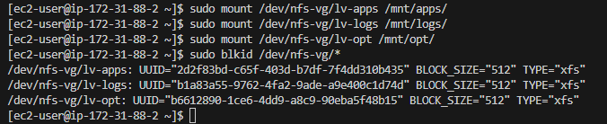

# **Project 7: DEVOPS (Single) TOOLING WEB SOLUTION  - We will implement a tooling web solution which makes access to Devops tools within the corporate infrastructure easily accessible for the Devops team using LAMP stack with remote Database and NFS servers which will consist of following components:
*Infrastructure: AWS, Webserver Linux: Red Hat Enterprise Linux 8, Database Server: Ubuntu 20.04 + MySQL, Storage Server: Red Hat Enterprise Linux 8 + NFS Server, Programming Language: PHP, Code Repository: GitHub*

## STEP 1 — *Prepare a NFS Server*

#### 1 *Launching a RHEL OS EC2 instance that will serve as "NFS Server". Create additional 2 volumes in the same AZ as your NFS-Server EC2, each of 8Gib but we will adopt 5 Gib to distribute to lv-opt, lv-apps, lv-logs. To utilize the AWS free tier volume we will create only 2 volumes which will be sub distributed to form our LOGICAL VOLUME. We will save time by adding our security groups for the NFS Server (TCP 111, TCP 2049, UDP 111, UDP 2049) at this point*

#### 2 *Connecting NFS-server to instance*

`ssh -i "Project7.pem" ec2-user@3.92.185.188` - publicIP

#### 3  - *NOW TO CONFIGURE LVM (logical Volume) on the NFS Server; Use lsblk command to inspect what block devices are attached to server. Notice names of your newly created devices. All devices in Linux reside in /dev/ directory. Inspect it with ls /dev/ and make sure you see all 2 newly created block devices there – their names will likely be xvdb, xvdc. This xvda is default*

`lsblk`

#### 4 - *Using df -h command to see all mounts and free space on your server*

`df -h` 

#### 5 - *Using gdisk utility to create a single partition on each of the 2 additional volume attached (xvdb xvdc) disks, remember there is an already xvda volume default, we will not utilize this*

`sudo gdisk /dev/xvdb` 

`?` - *shows help listing of all command*

`n` - *enter n to add a new partition*

`1` - *to select default*

`enter` - *first sector*

`enter` - *displays Last sector*

`8E00`

`p` - *to preview*

`w` - *to write*

`y` - *to complete partition*

`sudo gdisk /dev/xvdc` 

`n` - *enter n to add a new partition*

`1` - *to select default*

`enter` - *first sector*

`enter` - *displays Last sector*

`8300`

`p` - *to preview*

`w` - *to write*

`y` - *to complete partition*

#### 6 - *Using lsblk utility to view the newly configured partition on each of the 2 disks*

`lsblk` 

#### 7 - *Installing lvm2 package using sudo yum install lvm2. Run sudo lvmdiskscan command to check for available partitions. Note: RedHat uses yum to install whereas ubuntu uses apt*

`sudo yum install lvm2 -y`

`sudo lvmdiskscan` 

#### 8 - *Using pvcreate utility to mark each of 2 disks as physical volumes (PVs) to be used by LVM*

`sudo pvcreate /dev/xvdb1 /dev/xvdc1` 

#### 9 - *Verifying that your Physical volume has been created successfully by running sudo pvs*

`sudo pvs` 

#### 10 - *Using vgcreate utility to add all 2 PVs to a volume group (VG). Name the VG nfs-vg*

`sudo vgcreate nfs-vg /dev/xvdb1 /dev/xvdc1` 

#### 11 - *Verifying that your VG has been created successfully by running sudo vgs*

`sudo vgs` or `sudo vgdisplay`

#### 12 - *Using lvcreate utility to create 3 logical volumes for lv-apps, lv-logs and lv-opt (Use 1 3rd of the PV size - 15.99g/3 = 5Gib) and attach them to our nfs-vg . NOTE: lv-apps is used to store data for the Webservers while, lv-logs is used to store data for webserver logs and lv-opt for Jenkins Server in project 8*

`sudo lvcreate -n lv-apps -L 5G nfs-vg` 

`sudo lvcreate -n lv-logs -L 5G nfs-vg` 

`sudo lvcreate -n lv-opt -L 5G nfs-vg` 

#### 13 - *Verifying  that your Logical Volume has been created successfully by running sudo lvs*

`sudo lvs` 

#### 14 - *Creating mount points on /mnt directory for the 3 nfs logical volumes; Format LV with xfs, then Mount LV on /mnt/apps/ directory* 

`sudo mkdir /mnt/apps /mnt/logs /mnt/opt` 

`sudo vgdisplay -v #view complete setup - VG, PV, and LV` - *Verifying  the entire setup*

`sudo lsblk ` 

*Use mkfs.xfs to format the logical volumes with xfs filesystem*

`sudo mkfs.xfs /dev/nfs-vg/lv-apps` 

`sudo mkfs.xfs /dev/nfs-vg/lv-logs` 

`sudo mkfs.xfs /dev/nfs-vg/lv-opt` 

*Mounting the logical volume on the /mnt/apps/ directory*

`sudo mount /dev/nfs-vg/lv-apps /mnt/apps/`

`sudo mount /dev/nfs-vg/lv-logs /mnt/logs/`

`sudo mount /dev/nfs-vg/lv-opt /mnt/opt/`

#### 15 - *Update /etc/fstab file so that the mount configuration will persist (not lost) after restart of the server and The UUID of the device will be used to update the /etc/fstab file*

`sudo blkid /dev/nfs-vg/*` - *copy the UUID of the 3*

`sudo vi /etc/fstab` - *To update /etc/fstab, we type in # mounts for wordpress nfsserver, then edit (/dev/mapper/lv-apps UUID to /mnt/apps, /dev/mappe
r/lv-logs UUID to /mnt/logs and /dev/mapper/lv-opt UUID to /mnt/opt), and remove ending quotes*

`sudo mount -a` - *run to confirm successful configuration without error msg*

`df -h` - *run to view mounted LV*

#### 16 - *Install NFS server, configure it to start on reboot and ensure it is up and running*

`sudo yum update -y`

`sudo yum install nfs-utils -y`

`sudo systemctl start nfs-server.service`

`sudo systemctl enable nfs-server.service`

`sudo systemctl status nfs-server.service`

#### 21 - *Export the mounts for the webservers subnet cidr to connect as clients. For simplicity, you will install your all three Web Servers inside the same subnet, but in production set up you would probably want to separate each tier inside its own subnet for higher level of security. To check your subnet cidr – open your EC2 details in AWS web console and locate ‘Networking’ tab and open a Subnet link. - But before we export, Make sure we set up permission that will allow our Web servers to read, write and execute files on NFS:

`sudo chown -R nobody: /mnt/apps`

`sudo chown -R nobody: /mnt/logs`

`sudo chown -R nobody: /mnt/opt`

`sudo chmod -R 777 /mnt/apps`

`sudo chmod -R 777 /mnt/logs`

`sudo chmod -R 777 /mnt/opt`

`ll /mnt` - run to confirm change

*Configure access to NFS for clients within the same subnet (example of Subnet CIDR – 172.31.80.0/20 ):*

`sudo vi /etc/exports`

`/mnt/apps 172.31.80.0/20(rw,sync,no_all_squash,no_root_squash)`

`/mnt/logs 172.31.80.0/20(rw,sync,no_all_squash,no_root_squash)`

`/mnt/opt 172.31.80.0/20(rw,sync,no_all_squash,no_root_squash)`

`ESC + :wqa!` - run to save and exit

`sudo exportfs -arv` - run to export

*Check which port is used by NFS and open it using Security Groups (we already added the Inbound Rules during our nfs-server ec2 instance setup)*

`rpcinfo -p | grep nfs`

*you have to add inbound rule for the nfs server port tcp 2049 if you have not already, then restart nfs server*

`sudo systemctl restart nfs-server`

## STEP 2 — *Configure The Database Server*

#### 1 *Launched an EC2 instance on ubuntu 20.04 that will serve as "Database Server" we added inbound rule MYSQL/Aurora TCP 3306, and allowed 1 volume of 8 GiB*

#### 2 *Connect to database server EC2 Instance using the publicIP*

`ssh -i "Project7.pem" ubuntu@3.84.13.141`  - publicIP

`sudo apt update`

#### 3 *Install MySql Server*

`sudo apt install mysql-server -y` - had error E maybe I changed a new system: Unable to fetch some archives, maybe run apt-get update or try with --fix-missing

`sudo apt-get install --fix-missing` - fixed error with this code

`sudo apt install mysql-server -y` - resolved 

`sudo service mysql status`

#### 4   *we will Create a database and name it tooling, Create a database user and name it webaccess, Grant permission to webaccess user on tooling database to do anything only from the webservers subnet cidr*

`sudo mysql;`

mysql> `create database tooling;` 

mysql> `create user 'webaccess'@'%' identified with mysql_native_password by 'password'; `

*Grant permission to webaccess user on tooling database to do anything only from the webservers subnet cidr*

mysql> `grant all privileges on tooling.* to 'webaccess'@'%';`

mysql> `FLUSH PRIVILEGES;`

mysql> `show databases;`

mysql> `EXIT;`

*Edit **bind address** to 0.0.0.0 to allow all access* 

`sudo vim /etc/mysql/mysql.conf.d/mysqld.cnf`

`sudo systemctl restart mysql` - *restart mysql*

## STEP 3 — *Prepare 3 Web Servers but we used 2 Web Servers for this project*

#### 1  - *Prepare the Web Servers to serve the same content from shared storage solutions (NFS Server and MySQL database), already one DB can be accessed for reads and writes by multiple clients. For storing shared files that our Web Servers will use – we will utilize NFS and mount previously created Logical Volume lv-apps to the folder where Apache stores files to be served to the users (/var/www). This will allow us add or remove new ones at will and ensure data integrity on NFS and DB making our webservers stateless*. 

*Launch 3 new webservers EC2 instance with RHEL 8 Operating System*

*Edit inbound rule in the security group and add HTTP port 80*

#### 2 - Web Server1

`ssh -i "Project7.pem" ec2-user@ec2-3-84-16-20.compute-1.amazonaws.com`  

*so we will use shellscript to configure/ install NFS client, Mount /var/www/ and target the NFS server’s export for apps, install Remi's Repository, Apache amd PHP to replicate same on other web servers while editing IP to the (NFS Server Private IP addresses) *

`sudo vi shell.sh && sudo chmod +x shell.sh`

`#!/bin/bash`
`sudo yum install nfs-utils nfs4-acl-tools -y`
`sudo mkdir /var/www`
`sudo mount -t nfs -o rw,nosuid 172.31.86.215:/mnt/apps /var/www` - *sudo mount -t nfs -o rw,nosuid <NFS-Server-Private-IP-Address>:/mnt/apps /var/www*
`sudo echo "172.31.86.215:/mnt/apps /var/www    nfs defaults  0 0"  >> /etc/fstab` - *<NFS-Server-Private-IP-Address>:/mnt/apps /var/www nfs defaults 0 0*

`sudo yum install httpd -y`

`sudo dnf install https://dl.fedoraproject.org/pub/epel/epel-release-latest-8.noarch.rpm -y`

`sudo dnf install dnf-utils http://rpms.remirepo.net/enterprise/remi-release-8.rpm -y`

`sudo dnf module reset php -y`

`sudo dnf module enable php:remi-7.4 -y`

`sudo dnf install php php-opcache php-gd php-curl php-mysqlnd -y`

`sudo systemctl start php-fpm`

`sudo systemctl enable php-fpm`

`setsebool -P httpd_execmem 1`

`sudo systemctl status php-fpm`

`:wqa!`

`ll` - to see where shell.sh path is

`sudo su` - to change to root ip user

`./shell.sh` - run shell script

`df -h` - *to verify NFS was mounted successfully* 

`sudo systemctl status php-fpm`

#### 3 - Web Server2 repeat same as Web1

Launch webserver1 P7 EC2 instance with RHEL 8 Operating System

`ssh -i "Project7.pem" ec2-user@ec2-34-201-66-96.compute-1.amazonaws.com` - Web Server2 

`sudo vi shell.sh && sudo chmod +x shell.sh`

`#!/bin/bash`
`sudo yum install nfs-utils nfs4-acl-tools -y`
`sudo mkdir /var/www`
`sudo mount -t nfs -o rw,nosuid 172.31.86.215:/mnt/apps /var/www` - *sudo mount -t nfs -o rw,nosuid <NFS-Server-Private-IP-Address>:/mnt/apps /var/www*
`sudo echo "172.31.86.215:/mnt/apps /var/www    nfs defaults  0 0"  >> /etc/fstab` - *<NFS-Server-Private-IP-Address>:/mnt/apps /var/www nfs defaults 0 0*

`sudo yum install httpd -y`

`sudo dnf install https://dl.fedoraproject.org/pub/epel/epel-release-latest-8.noarch.rpm -y`

`sudo dnf install dnf-utils http://rpms.remirepo.net/enterprise/remi-release-8.rpm -y`

`sudo dnf module reset php -y`

`sudo dnf module enable php:remi-7.4 -y`

`sudo dnf install php php-opcache php-gd php-curl php-mysqlnd -y`

`sudo systemctl start php-fpm`

`sudo systemctl enable php-fpm`

`setsebool -P httpd_execmem 1`

`sudo systemctl status php-fpm`

`:wqa!`

`ll` - to see where shell.sh path is

`sudo su` - to change to root ip user

`./shell.sh` - run shell script

#### 4 - *To Restart Apache*

`sudo systemctl status php-fpm`

#### 5 - *Verify that Apache files and directories are available on the both Web Servers in /var/www and also on the NFS server in /mnt/apps. If you see the same files – it means NFS is mounted correctly.

`cd /var/www/html` - *on Web Server1*

`touch proj`

`ls`

`cd /var/www/html` - *on Web Server2*

`ls` - You should able to see *proj* file created on Web Server2 else nfs server not mounted properly.

`echo Hello >> proj` - *on Web Server1*

`ls`

`cat proj` - *on Web Server2, you should see "Hello"*

`rm proj` - *further action on Web Server1 and see same result of Web Server2*

#### 6 - *Fork the tooling source code from Bethrand Github Account to your Github account*

`sudo yum install git`

`git clone https://github.com/Bethrand/tooling.git`

`ls`

`cd tooling`

`ls`

#### 7 *We will Deploy the tooling website’s code to the Webserver. Then ensure that the html folder from the repository is deployed to /var/www/html*

`cd ..`

`mv tooling/* .`

`ls`

`ls tooling`

`ls`

`sudo rm -r tooling`

`ls html`

`mv html/* .` - *move html file into our html directory*

`yes`

`ls html`

`ls`

`sudo rm -r html` - *to delete the empty html file*

`ls`

`sudo yum install mysql`

`yes`

#### 8 - *Update the website’s configuration to connect to the database (in /var/www/html/functions.php file)*. *Apply tooling-db.sql script to your database using this command mysql -h <databse-private-ip> -u <db-username> -p <db-pasword> < tooling-db.sql* // connect to database $db = mysqli_connect('172.31.88.16', 'webaccess', 'password', 'tooling');*

`vi functions.php` - *on Web Server1*

####  9 - *Create in MySQL a new admin user with username: myuser and password: password: then INSERT INTO ‘users’ (‘id’, ‘username’, ‘password’, ’email’, ‘user_type’, ‘status’) VALUES -> (1, ‘myuser’, ‘5f4dcc3b5aa765d61d8327deb882cf99’, ‘user@mail.com’, ‘admin’, ‘1’);*

`mysql -u webaccess -ppassword -h 172.31.88.16 tooling` - *web Server1 terminal*

`show databases;`

`select * from users;`

`exit;`

####  9 - *disable SELinux sudo setenforce 0 To make this change permanent – open following config file sudo vi /etc/sysconfig/selinux and set SELINUX=disabled then restart httpd.*

`sudo setenforce 0` - *on Web Server1 & Web Server2*

`sudo vi /etc/sysconfig/selinux` - *on both web Servers1 & 2 set from SELINUX=enforcing to set SELINUX=disabled*

`sudo systemctl restart httpd` - * on Web Server1 & 2*

####  10 - *Open the website in your browser http://<Web-Server-Public-IP-Address-or-Public-DNS-Name>/index.php and make sure you can login into the website with myuser user.*

*WEB SERVER 1 SUCCESSFUL*

*WEB SERVER 2 SUCCESSFUL*

