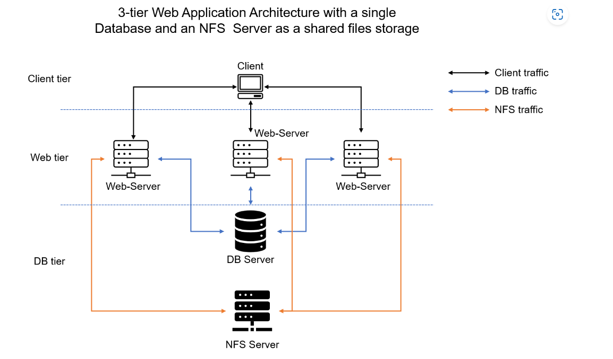

# DEVOPS TOOLING WEBSITE SOLUTION

# XFS is a type of file system designed by Silicon Graphics for the Unix/Linux operating system. File systems like XFS manage how data is stored and retrieved on a storage device such as a hard drive, SSD, or USB stick. XFS is known for its high performance, scalability, and robustness, especially in situations dealing with large files and large storage volumes.

# NFS, on the other hand, is a protocol used to allow a system to share directories and files with others over a network. It allows a system to view, store, and update files on a remote system as though they were on its own local system.

# XFS is used in situations where high performance and reliability are required, such as database applications, data warehousing, video streaming, and other scenarios where handling large amounts of data is a priority.

# NFS is used when you want to share files and directories over a network across different systems. It's frequently used in distributed systems and in environments where multiple systems need access to the same set of files.

# XFS operates on a lower level, directly interfacing with the physical (or virtual) storage on a machine. It decides how data is organized on the storage medium.

# NFS operates at a higher level, it doesn't care what kind of file system the remote machine uses (it could be XFS, EXT4, BTRFS, etc.). It simply provides a protocol for reading and writing files over the network.

# XFS and NFS are not competing technologies, but rather are often used together: NFS to share the files over a network, and XFS to manage the storage of those files on the physical disk