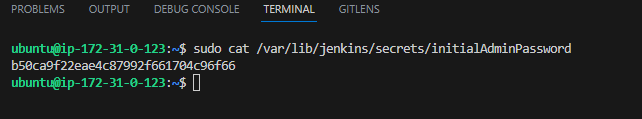

# **Project 9: TOOLING WEBSITE DEPLOYMENT AUTOMATION WITH CONTINUOUS INTEGRATION. INTRODUCTION TO JENKINS**

   *In this project we are going to utilize Jenkins CI capabilities to make sure that every change made to the source code in GitHub https://github.com/Bethrand/tooling will be automatically be updated to the Tooling Website*

## STEP 1 — *Install and configure Jenkins server on Ubuntu 20.04 EC2 instance and name it Jenkins with security group (TCP 8080) when spining the EC2 instance*

`ssh -i "PBDEV.pem" ubuntu@ec2-44-204-93-157.compute-1.amazonaws.com`

#### 2  - *Install JDK (since Jenkins is a Java-based application)*

*Installing Web1-Apache (Upstream Webserver)*

`sudo apt update`

`sudo apt install openjdk-17-jre -y`

`java -version`

#### 3  - *Install Jenkins*

`curl -fsSL https://pkg.jenkins.io/debian-stable/jenkins.io-2023.key | sudo tee \
  /usr/share/keyrings/jenkins-keyring.asc > /dev/null
echo deb [signed-by=/usr/share/keyrings/jenkins-keyring.asc] \
  https://pkg.jenkins.io/debian-stable binary/ | sudo tee \
  /etc/apt/sources.list.d/jenkins.list > /dev/null
sudo apt-get update
sudo apt-get install jenkins`

*Make sure Jenkins is up and running*

`sudo systemctl status jenkins`

#### 4 - *Perform initial Jenkins setup*

http://44.204.93.157:8080/

*Retrieve Jenkins Password from your server to login* 

`sudo cat /var/lib/jenkins/secrets/initialAdminPassword`

*Install jenkins suggested plugins from server, create admin username and password and get your Jenkins server address*

## STEP 2 — *Configure Jenkins to retrieve source codes from GitHub using Webhooks*

#### 1 - *Enable webhooks in your GitHub in tooling repository settings*

*Go to settings - webhook - Add wehook - paste JenkinsURL/github-webhook/ - content type/application/jason - push event - Active - Add webhook* 

#### 2 - *Go to Jenkins web console, click “New Item” and create a “Freestyle project”*

*To connect your GitHub repository to Jenkins Website, you will need to provide its URL, you can copy from the repository itself*

*https://github.com/Bethrand/tooling.git*

*In configuration of your Jenkins freestyle project choose Git repository, provide there the link to your Tooling GitHub repository and credentials (user/password) so Jenkins could access files in the repository.*

*Go to Source Code Management - Git - RepositoryURL - Credentials Add - UsrnamePassword - Add - Select Username on Credential - Apply - Save*

*Save the configuration and let us try to run the build. For now we can only do it manually. Click “Build Now” button, if you have configured everything correctly, the build will be successfull and you will see it under #1*

*JENKINS BUILD STATUS*

*You can open the build and check in “Console Output” if it has run successfully*

*JENKINS CONSOLE OUTPUT*

#### 3 - CONFIGURE BUILD TO PRODUCE. Click “Configure” your job/project and add these two configurations*

##### I - *Configure triggering the job from GitHub webhook on Jenkins website*

*Go to JenkinsWebserver - Projectname - Configure - Build Triggers - Github hook triggers for GITScm polling*

##### II - *Configure “Post-build Actions” to archive all the files – files resulted from a build are called “artifacts”, type in ** to file everything*

*Go to Post-build Actions - Archive the artifacts - Apply - Save*

##### III - *make some change in any file in your GitHub repository (e.g. README.MD file) and push the changes to the master branch.*

You will see that a new build has been launched automatically (by webhook) and you can see its results – artifacts, saved on Jenkins server.

### Automated Jenkins Job Configured Successfully

*Lets confirm our artifacts stored by default on Jenkins server locally*

`cd /var/lib/jenkins/jobs/`

`ls`

`cd TestProject9`

`ls`

`cd builds`

`ls`

`cd 2`

`ls`

`cd archive`

`ls`

## STEP 3 — *Configure Jenkins to copy files to NFS server via SSH* Now we have our artifacts saved locally on Jenkins server, the next step is to copy them to our NFS server to /mnt/apps directory.

##### I - *On the Jenkins Server, Install “Publish Over SSH” plugin.*

*Go to Dashboard - Manage Jenkins - Manage Plugins - Plugins - Available plugins - search "publish over SSH" - Install without restart*

##### II - *Configure the job/project to copy artifacts over to NFS server.*

*Go to Dashboard - Manage Jenkins - Configure system - System - publish over SSH - key (copy/paste nfsserver .pem) - SSH Servers ADD - Name (NFSP9) - Hostname (NFSP9 private IP) - Username (ec2-user) - Remote Directory (/mnt/apps) - Test Configuration - see success - Apply - Save*

##### III - *Save the configuration, open your Jenkins job/project configuration page and add another one “Post-build Action”*

*Go to Dashboard - TestProject9 - Configuration - Post-build Actions - Send build artifacts over SSH - Source files (**) - Remote directory (/mnt/apps) - Apply - Save*

##### IV - *Save this configuration and go ahead, change something in README.MD file in your GitHub Tooling repository*

lets make a change on test jenkins we added in the github README.md file and commit. Webhook should trigger a build in our Jenkins server. If Console OUtput Finished: Unstable then check error and grant Jenkins permission on the NFS /mnt/apps directory using Jenkins subnet CIDR `sudo vi /etc/exports` , `sudo exportfs -arv`

## CONSOLE OUTPUT SUCCESS

##### V - *To make sure that the files in /mnt/apps have been updated – connect via SSH/Putty to your NFS server and check README.MD file*

`ls /mnt/apps`

`cat /mnt/apps/README.md`
